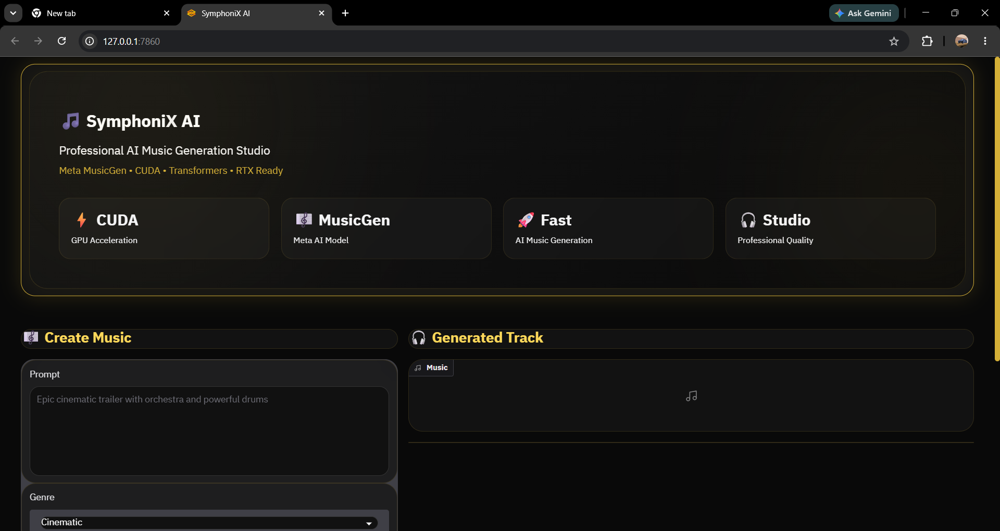
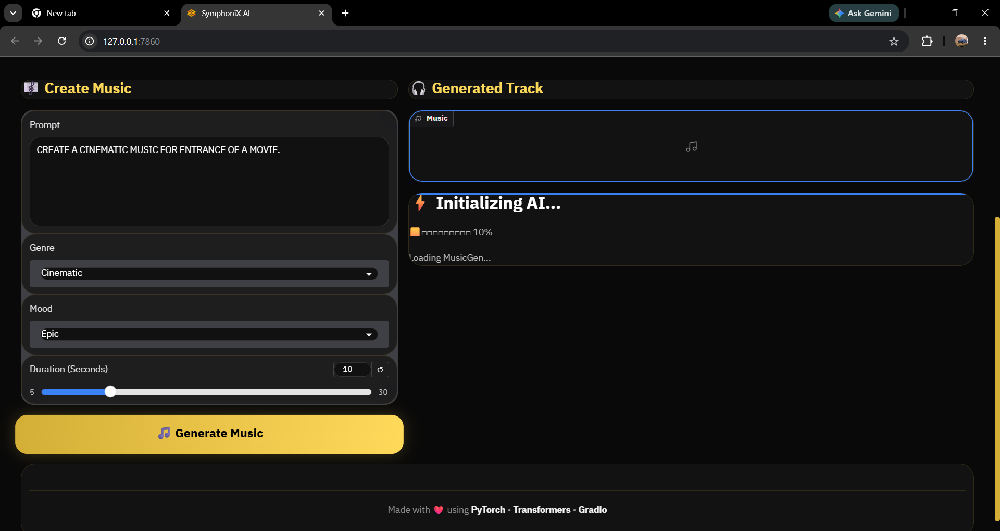
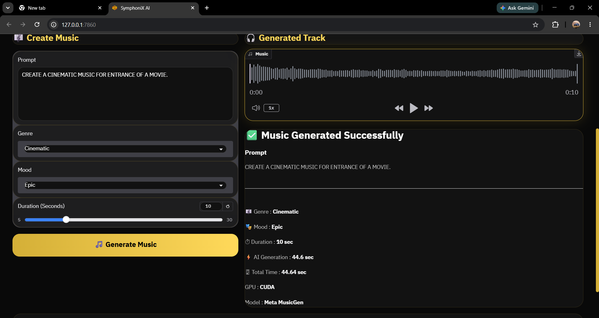

<div align="center">

# 🎵 SymphoniX AI

### Professional AI Music Generation Studio

Generate high-quality instrumental music from natural language prompts using **Meta MusicGen**, **PyTorch**, **Transformers**, and **Gradio**.


</div>

---

# 📖 Overview

SymphoniX AI is an AI-powered music generation application that converts text prompts into original instrumental music using Meta's MusicGen model.

The project features a modular architecture with dedicated services for prompt processing, music generation, and UI components. It supports CUDA acceleration for faster inference and provides an intuitive interface for generating music across multiple genres and moods.

---

# ✨ Features

- 🎵 AI Instrumental Music Generation
- ⚡ CUDA GPU Acceleration
- 🎼 Multiple Music Genres
- 🎭 Mood-Based Generation
- ⏱ Adjustable Audio Duration
- 🎧 Built-in Audio Player
- 🧠 Prompt Enhancement
- 🏗 Modular Project Architecture
- 🖥 Clean Gradio Interface
- 🚀 Hugging Face Transformers Integration

---

# 📸 Screenshots

## 🏠 Home



---

## ⚡ Music Generation



---

## 🎧 Generated Output



---

# 🛠 Tech Stack

- Python
- PyTorch
- Meta MusicGen
- Hugging Face Transformers
- Gradio
- CUDA
- NumPy
- SciPy

---

# 📂 Project Structure

```text
SymphoniX-AI
│
├── models/
│   ├── __init__.py
│   └── musicgen_provider.py
│
├── services/
│   ├── export_service.py
│   ├── history_service.py
│   ├── music_service.py
│   └── prompt_service.py
│
├── ui/
│   ├── components.py
│   ├── layout.py
│   └── theme.py
│
├── utils/
│
├── app.py
├── config.py
├── requirements.txt
├── README.md
└── .gitignore
```

---

# ⚙ Installation

```bash
git clone https://github.com/pratikeyyy/SymphoniX-AI.git

cd SymphoniX-AI

python -m venv .venv

# Windows
.venv\Scripts\activate

# Linux / macOS
source .venv/bin/activate

pip install -r requirements.txt

python app.py
```

---

# 🚀 Usage

1. Launch the application.
2. Enter a descriptive music prompt.
3. Choose a genre.
4. Select a mood.
5. Set the desired duration.
6. Click **Generate Music**.
7. Listen to the generated instrumental track.

---

# 🧠 Example Prompt

```text
Epic cinematic orchestral soundtrack with emotional strings,
powerful drums, deep brass, dramatic build-up,
high-quality studio production.
```

---

# 🔮 Future Improvements

- 🎤 AI Lyrics Generation
- 🎙 AI Vocal Generation
- 🖼 AI Album Cover Generator
- 📈 Waveform Visualization
- ❤️ Favorite Tracks
- 📜 Generation History
- ☁ Cloud Deployment
- 🎼 More Music Models

---

# 👨‍💻 Author

**Pratik Kumar**

GitHub: https://github.com/pratikeyyy

---

# ⭐ Support

If you found this project useful, consider giving it a ⭐ on GitHub.

It helps support the project and encourages future development.
